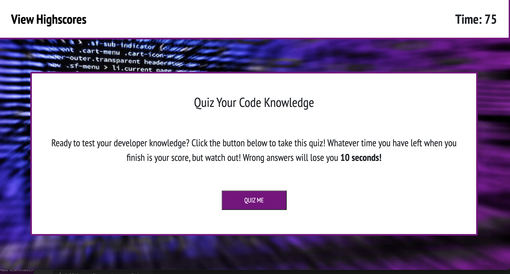

# Code Quiz For The Code Wiz!
Studying coding? Feelin' lucky? Take this quiz!

## Deployed Link
Check out the quiz in action [here](https://ahfotis.github.io/CodeQuizForTheCodeWiz/)

## Reference Image
A photo of the homepage for reference 

## Basic Function
* The quiz asks the user a series of questions relatting to CSS, HTML, and JavaScript.
* Basic Rules
    * Made up of multiple choice questions
    * Users have 75 seconds to finish quiz.
    * If the user answers a question incorrectly, the timer reduces by ten seconds.
    * Score is determined by how many seconds are left on the timer when user finishes.
    * User can save highscore to be displayed on score page.

## Project Criteria
### User Story

```
AS A coding boot camp student
I WANT to take a timed quiz on JavaScript fundamentals that stores high scores
SO THAT I can gauge my progress compared to my peers
```

### Acceptance Criteria

```
GIVEN I am taking a code quiz
WHEN I click the start button
THEN a timer starts and I am presented with a question
WHEN I answer a question
THEN I am presented with another question
WHEN I answer a question incorrectly
THEN time is subtracted from the clock
WHEN all questions are answered or the timer reaches 0
THEN the game is over
WHEN the game is over
THEN I can save my initials and my score
```
## Credits
Project template provided by Trilogy Education Services, LLC, a 2U, Inc. brand. Confidential and Proprietary. All Rights Reserved.

## License
MIT License

Copyright (c) [2021] [Anna Hickey Fotis]
